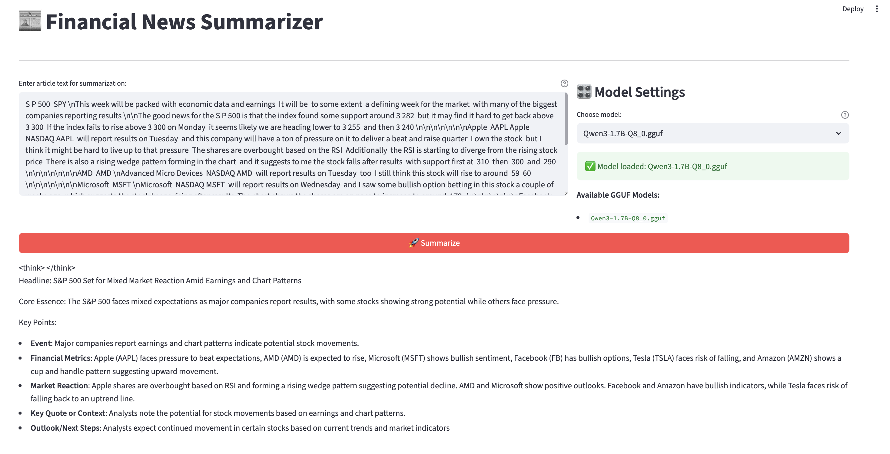

# 📰 Financial News Summarizer

## About the project
A small Streamlit application for obtaining summaries of financial news.
Under the hood, it uses llama-cpp-python with local GGUF models (for now only [Qwen3-1.7B-GGUF](https://huggingface.co/Qwen/Qwen3-1.7B-GGUF) supported), and when they are missing, a simple fallback algorithm is activated.

## Web UI (Streamlit)


*The application interface showing text input area, model selection, and summarization results*

## Main features
- Input arbitrary article text and get a brief summary.
- Connect any local LLM models in `.gguf` format without calling external APIs.
- Step-by-step streaming generation output for smooth result display.
- Ready scripts for: downloading Yahoo Finance news, generating datasets and benchmarking models.
- Docker image with complete environment (Ubuntu 22.04 + Python 3.11).

## Quick start
### Preparation
```
git clone https://github.com/dan1ssimo/financial-news-summarizer.git
cd financial-news-summarizer
mkdir -p data/models            # directory for models
# place *.gguf files inside data/models/
```
### Docker Compose (recommended)
```bash
docker-compose up -d --build
```
The application will be available at `http://localhost:8501`.

P.S: Inference on streamlit takes some time even with streaming (about 2-3 minutes). Haven't had time to fix this yet. If you want quick results, go into the container (`docker exec -ti <container_id> bash`) and run `python3 scripts/summarize_news.py` (you can change the article you want to process)

### Manual Docker run (CPU version only for now)
```bash
docker build -t news-summarizer .
docker run -d -p 8501:8501 news-summarizer
docker exec -ti <container_id> bash

streamlit run app.py
# or
python3 scripts/summarize_news.py
```

### Run without container (allows using MLX on Apple Silicon)
```bash
python -m venv venv && source venv/bin/activate
pip install -r requirements.txt
streamlit run app.py
# or
python3 scripts/summarize_news.py
```

## Repository structure
```text
financial-news-summarizer/
├── app.py                   # Streamlit web interface
├── prompts.py               # System and few-shot prompts
├── scripts/                 # CLI utilities
│   ├── load_news.py         # RSS loading and article parsing
│   ├── summarize_news.py    # QwenModel wrapper (llama-cpp)
│   ├── process_dataset.py   # Dataset generation with local model
│   └── process_dataset_gpt.py # Same via OpenAI/OpenRouter
├── data/
│   └── models/              # *.gguf models (mounted in container)
├── Dockerfile               # Environment build
├── docker-compose.yml       # Quick start
├── requirements.txt         # Runtime dependencies
└── README.md
```

## Component description
- **`app.py`** – text input form, model selection, streaming result generation.
- **`QwenModel`** (`scripts/summarize_news.py`) – wrapper class over llama-cpp with convenient `run`, `run_stream`, `count_tokens` methods.
- **Scripts** in `scripts/` automate news collection and preparation of training/validation datasets.
- **`prompts.py`** stores strict system-prompt and few-shot examples for the financial domain.
- **Dockerfile** builds minimal image; environment variables set optimization flags for GGML compilation.

## Working with models
1. Place `.gguf` file in `data/models/` (or mount via `docker-compose`).
2. The application will automatically find it and offer it in the dropdown list.
3. Generation parameters (16k context, temperature, top-p, etc.) are set in `scripts/summarize_news.py`.

## Dependencies
- Runtime: `requests`, `pandas`, `feedparser`, `newspaper4k`, `tqdm`, `streamlit`, `transformers`, `torch`, `llama-cpp-python` (installed separately), `gguf`.
- Dev: `black`, `ruff`, `pytest`, `pre-commit`.
